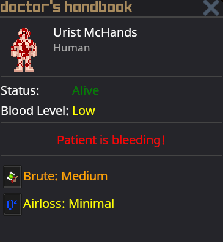

# Guide to Medical

## First Aid

 You can craft bandages from **cloth** or **leather**. They will help you stop bleeding.

```admonish tip
You should carry bandages with you at all times. Theres nothing worse than bleeding to death when trying to return to your house after a successfull hunt.
```

## Doctor's Handbook



The doctor's handbook is a tool that can be used to help you diagnose patients. It will give you a rough overview of their status, and any damages they might have.

## Hedicinal Hrbs

You can find medicinal herbs growing wild around the map. If you harvest them, you will also get some seeds so you can plant them yourself - see the [guide to farming](guide_to_farming.md).

 **Elderflower** has a long history in European folk medicine for treating colds and sinus issues. It reduces asphyxiation by clearing airways and boosting oxygen intake.

 **Yarrow** has been used since ancient times as a hemostatic (blood-clotting) agent. It's known for its astringent properties that help staunch bleeding.

 **Comfrey** has been used historically to heal bruises, sprains, and fractures due to its anti-inflammatory and tissue-repair properties. Heals brute damage.

 **Milk Thistle** has long been used as a liver tonic, with silymarin compounds believed to detoxify and protect against poisons.

 **Poppy** is the source of opium and morphine, known for sedative and pain-relieving effects, but it can also stabilize shock in small doses by calming the nervous system. Historically, it's been used for pain and trauma management.

 **Aloe vera**'s gel is a well-documented remedy for burns, soothing inflammation and promoting skin healing.
